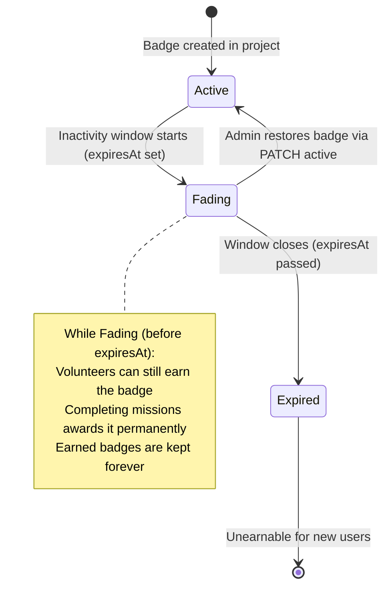
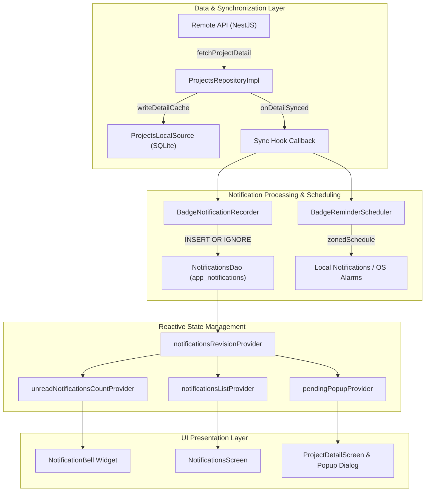
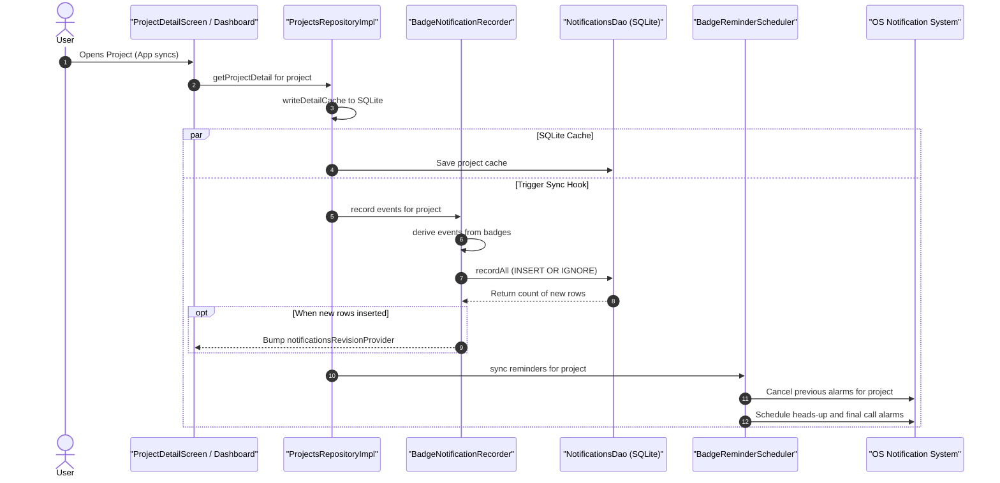
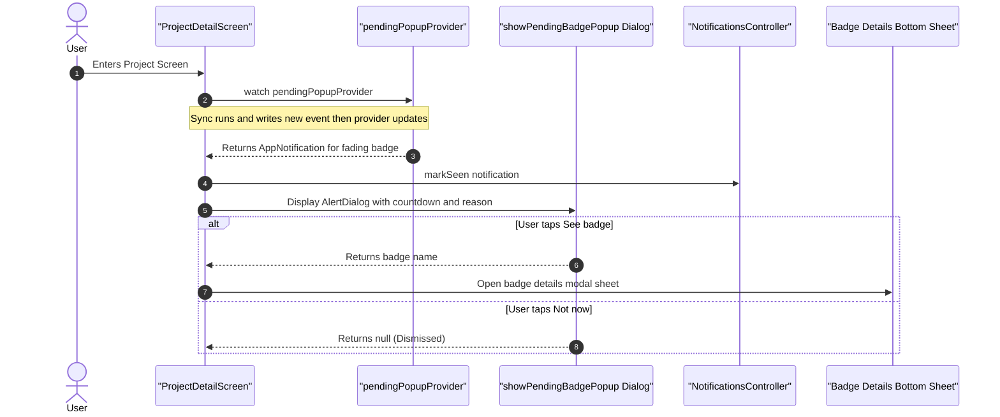
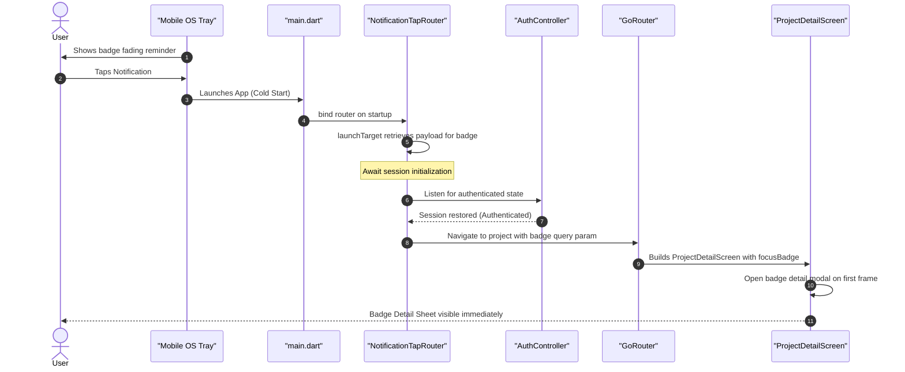

# Adaptive Gamification: Badge Fading

Badge Fading is an adaptive gamification mechanism in Rayuela designed to dynamically react to volunteer engagement and project activity levels. When volunteer participation drops in a project or a time window begins to lapse, badges enter a temporary "fading" phase before expiring completely, providing a time-bounded incentive for the community to contribute.

---

## 1. Conceptual Model & Lifecycle

### What is Badge Fading?
Instead of immediately revoking or abruptly expiring badges, the platform transitions badges into a **Fading** state with an explicit expiration timestamp (`expiresAt`). During this fading period:
* **Community Incentive**: Volunteers can still complete missions and earn the badge before the countdown reaches zero.
* **Permanent Ownership**: When an individual volunteer earns a fading badge, it is awarded **permanently** (`earned: true` / retained forever).
* **Project-Level Rule Persistence**: A user earning the badge does **not** reset the badge rule status back to `active` for the rest of the project. The badge rule remains fading for the community until `expiresAt` elapses or until an administrator manually restores it.



### Availability Computation
In the domain model (`lib/features/dashboard/domain/entities/project_detail.dart`), badge availability is deterministically evaluated using `availabilityAt(DateTime now)`:

| Status Attribute | Temporal Condition | Computed Availability | UI & Notification Behavior |
| :--- | :--- | :--- | :--- |
| `active` | Default state | `active` | Standard badge display; no warnings or countdowns. |
| `faded` | `expiresAt > now` | `fading` | Amber warning hourglass icon, active countdown ("X days left", "Y hours left"), popup alerts, and scheduled OS alarms. |
| `faded` / `expired` | `expiresAt <= now` | `expired` | Disabled/greyed-out badge; historical expiration notification; window permanently closed. |

---

## 2. System Architecture

Rayuela implements an **offline-first, zero-server-queue** notification and alert system. The backend simply exposes the gamification state on project resources; the mobile client deterministically derives events, schedules local OS reminders, and updates reactive state.



---

## 3. Implementation Details

### 3.1 Backend REST API & Trigger Mechanisms
Backend administrators or automated gamification decay workers update a badge rule's state by sending a `PATCH` request:

```http
PATCH /v1/gamification/:projectId/badge/:badgeId/status/faded
Content-Type: application/json

{
  "expiresAt": "2026-08-25T16:00:00Z",
  "fadeReason": "Low activity detected during the last month"
}
```

To restore a badge back to normal operation:
```http
PATCH /v1/gamification/:projectId/badge/:badgeId/status/active
```

The response is embedded in the project details payload returned to mobile clients (`GET /v1/projects/:id`).

---

### 3.2 Mobile Persistence Layer (`AppDatabase` & `NotificationsDao`)
A local SQLite table `app_notifications` stores derived notifications:

* **File Reference**: `lib/core/database/database.dart`, `lib/features/notifications/data/notifications_dao.dart`
* **Schema Fields**:
  * `id TEXT PRIMARY KEY`: Deterministic fingerprint format (`$userId|$type|$projectId|$badgeName|$window`).
  * `user_id TEXT`: User isolation key (ensures multi-user separation on a shared device).
  * `type TEXT`: Event type (`badgeFading` or `badgeExpired`).
  * `project_id TEXT`: Associated project identifier.
  * `badge_name TEXT`: Target badge identifier.
  * `expires_at TEXT`: Target deadline in UTC ISO-8601 string format.
  * `fade_reason TEXT`: Contextual reason provided by project administrators.
  * `created_at TEXT`: Local derivation timestamp.
  * `read_at TEXT`: Timestamp when the user opened the Notifications screen.
  * `seen_at TEXT`: Timestamp when the in-app popup dialog was displayed or dismissed.

---

### 3.3 Event Derivation (`BadgeNotificationRecorder`)
* **File Reference**: `lib/features/notifications/domain/badge_notification_recorder.dart`
* On every project detail sync (`onDetailSynced` hook), `BadgeNotificationRecorder` evaluates all badges in the project against the current clock:
  1. **Fading Detection**: When a badge is `faded` with `expiresAt > now`, a `badgeFading` record is generated.
  2. **Expiration Detection**: When a badge has expired (`expiresAt <= now`), a `badgeExpired` record is generated **only if** the user previously received a `badgeFading` notification. This prevents *historical poisoning* (bombarding fresh app installs with years of old expired badge alerts).
  3. **Idempotency**: Records are inserted using `INSERT OR IGNORE`. If new rows are inserted, `notificationsRevisionProvider` is invalidated.

---

### 3.4 Out-of-App OS Reminders (`BadgeReminderScheduler`)
* **File Reference**: `lib/features/notifications/domain/badge_reminder_scheduler.dart`
* Leverages `flutter_local_notifications` to schedule background operating system reminders:
  * **Heads-Up Reminder**: Scheduled for 3 days before `expiresAt`.
  * **Final Call Reminder**: Scheduled for 2 hours before `expiresAt`.
* **Alarm Synchronization**: Existing scheduled alarms for the project are replaced on sync. If a badge is restored to active or expires, obsolete alarms are cancelled.
* **Payload**: Carries JSON payload `{ "projectId": "...", "badgeName": "..." }` to power deep links.

---

### 3.5 Reactive State Management (Riverpod)
* **File Reference**: `lib/features/notifications/presentation/notifications_providers.dart`
* **`notificationsRevisionProvider`**: An integer state counter incremented when DB changes occur.
* **`notificationsListProvider`**: Automatically recalculates the full list of notifications ordered by `created_at DESC`.
* **`unreadNotificationsCountProvider`**: Evaluates the number of notifications where `read_at IS NULL` for the active user.
* **`pendingPopupProvider(projectId)`**: Returns the most recent unseen (`seen_at IS NULL`) fading or expired notification for a specific project.

---

### 3.6 Presentation Views & User Journeys

#### 1. Dashboard Screen (`DashboardScreen`)
* Features the **`NotificationBell`** in the `AppBar` for authenticated users.
* Displays a badge with the unread count from `unreadNotificationsCountProvider`.
* Tapping routes the user to `/notifications`.

#### 2. Notifications Screen (`NotificationsScreen`)
* Displays notification tiles with distinct color themes:
  * **Amber / Warning**: Fading badge with dynamic countdown ("X days left", "Y hours left").
  * **Grey / Neutral**: Expired badge notice.
* **Read-State Latching**: Unread items are marked with `read_at` on screen entry using post-frame callbacks to avoid reactive build loops.
* **Tap Navigation**: Tapping a tile marks it `seen` and pushes `ProjectDetailScreen` with query parameter `?badge=<badgeName>`.

#### 3. Project Detail Screen (`ProjectDetailScreen`)
* **In-App Transition Alert (`showPendingBadgePopup`)**: When entering a project with an unseen fading badge, an `AlertDialog` pops up detailing the expiration countdown and fade reason.
* The popup immediately sets `seen_at` in SQLite so the user is only interrupted once.
* Actions:
  * *"Not now"*: Dismisses dialog.
  * *"See badge"*: Automatically opens the Badge Details bottom sheet.
* **Deep Link Badge Focus**: If navigated via `?badge=<name>`, the screen immediately triggers `_showBadgeDetails()` on first frame.

---

### 3.7 Deep Linking & Cold Launches (`NotificationTapRouter`)
* **File Reference**: `lib/features/notifications/domain/notification_tap_router.dart`
* Handles user interaction with background OS notification alerts:
  1. Catches notification payload upon tap.
  2. If the application is cold-starting, waits for authentication state to be initialized.
  3. Directs `GoRouter` to `/project/:id?badge=:badgeName`.

---

## 4. Sequence Workflows

### 4.1 Project Sync & Local Derivation


### 4.2 In-App Dialog Alert Flow


### 4.3 Cold-Start Background Notification Deep Link


---

## 5. Engineering & Robustness Considerations

1. **Deterministic Deduplication**:
   Composite primary keys (`$userId|$type|$projectId|$badgeName|$window`) combined with `INSERT OR IGNORE` guarantee idempotency regardless of sync frequency.
2. **Historical Poisoning Protection**:
   Newly registered users or clean installations do not receive notifications for badges that expired in the past without having gone through the active fading phase on that client.
3. **Multi-User Isolation**:
   All database queries, unread counters, and in-app notifications are filtered by `user_id`, maintaining user boundaries when multiple accounts switch on the same device.
4. **Reactive Render Safety**:
   Transitions from unread to read status use latched state checks (`_markedRead`) executed inside post-frame callbacks to prevent cyclic UI re-renders in Flutter.
