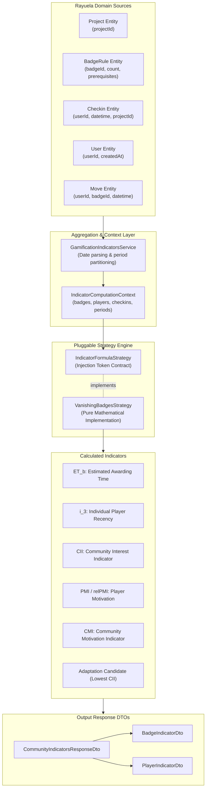

# Adaptive Gamification Indicators Engine

The **Adaptive Gamification Indicators Engine** calculates real-time community engagement, player contribution trajectories, and badge-specific interest metrics. These metrics empower the platform to automatically detect stagnation and adapt gamification rules to reignite volunteer participation.

---

## 1. Modular & Pluggable Architecture

The engine is engineered as a decoupled, isolated module within the backend architecture:

- **Isolated NestJS Module (`GamificationIndicatorsModule`)**: Completely decoupled from the transactional gamification engine and check-in processing pipeline. Evaluating indicators does not mutate user progression or lock database tables.
- **Pluggable Strategy Pattern (`IndicatorFormulaStrategy`)**: Mathematical calculations are extracted behind an abstract interface contract and bound via NestJS dependency injection (`INDICATOR_FORMULA_STRATEGY`).
- **Extensible & Flexible**: Different mathematical formulations, recency decay curves, or period aggregation windows can be plugged in or tested without modifying DAOs, controllers, or domain models.

```
┌────────────────────────────────────────────────────────┐
│             GamificationIndicatorsService             │
└───────────────────────────┬────────────────────────────┘
                            │ Delegates computation context
                            ▼
        ┌──────────────────────────────────────┐
        │     «interface»                      │
        │     IndicatorFormulaStrategy         │
        └──────────────────▲───────────────────┘
                           │ implements
        ┌──────────────────┴───────────────────┐
        │     VanishingBadgesStrategy          │
        │     (Pure Mathematical Calculation)  │
        └──────────────────────────────────────┘
```

---

## 2. Domain Model & Indicator Mapping

The indicators engine bridges Rayuela's core domain models into a unified computation context and maps the computed metrics into structured response DTOs:



### Domain Mapping Breakdown

| Rayuela Domain Entity / DAO | Input Role in Engine | Output Indicator |
| :--- | :--- | :--- |
| **`Project`** | Establishes the bounded community and context identifier. | `projectId` |
| **`BadgeRule` (`GamificationDao`)** | Defines target requirements, current badge status (`active`, `faded`, `expired`), and prerequisite DAG relationships. | $ep(b)$ (eligible pool), Prerequisite chains |
| **`User` (`UserDao`)** | Supplies player join dates ($t_{\text{join}}$) and registered account profiles. | $t_0(p, b)$ (baseline date for root badges) |
| **`Checkin` (`CheckInDao`)** | Provides timestamped citizen science contributions, partitioned into consecutive calendar periods $s_1, s_2, \dots, s_n$. | $cnum(p, s)$, $PMI(p)$, $relPMI(p)$, $CMI$ |
| **`Move` (`MoveDao`)** | Records historical award events, tracking the exact contributions and timestamps at which players unlocked badges. | $U_b$ (earners set), $ET_b$, $t_0(p, b)$ for child badges |

---

## 3. Mathematical Indicators Summary

The default implementation (`VanishingBadgesStrategy`) evaluates:

1. **Estimated Awarding Time ($ET_b$)**: Historical average check-ins required by players who earned badge $b$. Falls back to immediate prerequisite thresholds during cold starts.
2. **Individual Recency Interest ($i_3(p, b)$)**: Measures how recently player $p$ became eligible for badge $b$:
   $$\text{recency}(p, b) = \text{asOfDate} - t_0(p, b)$$
   $$i_3(p, b) = \frac{1}{\text{recency}(p, b) + 1}$$
   If badge $b$ is unachievable for player $p$ (unmet prerequisites), $i_3(p, b) = 1.0$.
3. **Community Interest Indicator ($CII(b)$)**: The median individual interest across all players eligible to earn badge $b$ ($ep(b)$):
   $$CII(b) = \text{median}(\{i_3(p, b) : p \in ep(b)\})$$
   A declining $CII$ signals that eligible players are stalling and losing interest in badge $b$.
4. **Player Motivation Indicator ($PMI(p)$)**: The number of periods where player $p$ sustained or increased contributions compared to the previous period:
   $$cnum(p, s) \ge cnum(p, \text{prev}(s)) \land (cnum(p, s) + cnum(p, \text{prev}(s)) > 0)$$
5. **Community Motivation Indicator ($CMI$)**: The median relative motivation across all active contributors:
   $$\overline{PMI} = \frac{1}{|P|} \sum_{p \in P} PMI(p), \quad relPMI(p) = \frac{PMI(p)}{\overline{PMI}}, \quad CMI = \text{median}(\{relPMI(p) : p \in P\})$$
6. **Adaptation Candidate Badge ($b^*$)**: Identifies the active badge with the lowest $CII$, representing the primary bottleneck where community interest has waned the most.

---

## 4. Current State vs. Future Strategy Integration

### Current State: On-Demand REST Endpoint
The engine is currently exposed via an authenticated HTTP endpoint:
```http
GET /v1/gamification-indicators/:projectId?startDate=01-07-2026&asOfDate=20-07-2026&daysPerPeriod=7
Authorization: Bearer <JWT_TOKEN>
```
This allows:
- Real-time exploration and parameter tuning (`daysPerPeriod`, custom `startDate`, point-in-time `asOfDate`).
- Visual debugging through documentation tools and simulators.
- Empirical verification of community health before enabling automated rule mutations.

### Future State: Automated Badge Fading Adaptation Loop
In upcoming phases, this engine will directly drive the **Badge Fading** adaptation strategy:
1. A recurring cron worker periodically runs `calculateIndicators` for active projects.
2. If community motivation drops below threshold ($CMI < \tau_{\text{trigger}}$), the adaptation pipeline is triggered.
3. The engine selects the candidate badge with lowest interest ($b^* = \arg\min CII(b)$).
4. The system automatically transitions badge $b^*$ to `faded` status with an expiration timestamp (`expiresAt`), broadcasting notifications to prompt community participation.

---

## 5. API Reference

### `GET /v1/gamification-indicators/:projectId`

#### Query Parameters

| Parameter | Type | Required | Default | Description |
| :--- | :--- | :--- | :--- | :--- |
| `startDate` | string | No | Earliest checkin | Timeline origin for Period 1. Accepts ISO-8601, `DD-MM-YYYY`, or `DD/MM/YYYY`. |
| `asOfDate` | string | No | Now | Horizon timestamp. Accepts ISO-8601, `DD-MM-YYYY`, or `DD/MM/YYYY`. |
| `daysPerPeriod` | number | No | `7` | Duration of each period $s$ in days (default: weekly). |
| `minActiveCheckins` | number | No | `1` | Minimum contributions required to qualify as an active player. |

#### Sample Response (`200 OK`)

```json
{
  "projectId": "67702f23258db9ef444b0e8b",
  "currentPeriod": 3,
  "startDate": "2026-07-01T00:00:00.000Z",
  "asOfDate": "2026-07-20T23:59:59.999Z",
  "daysPerPeriod": 7,
  "totalPlayers": 12,
  "activePlayers": 8,
  "totalContributions": 45,
  "avgPMI": 1.5,
  "CMI": 1.0,
  "adaptationCandidateBadge": {
    "badgeId": "b-expert-mapper",
    "badgeName": "Mapeador Experto",
    "status": "active",
    "earnedCount": 1,
    "earnedUsers": ["user_101"],
    "ET_b": 15.0,
    "eligibleCount": 4,
    "eligibleUsers": ["user_102", "user_103", "user_104", "user_105"],
    "CII": 0.0526,
    "isLowestCII": true
  },
  "badges": [
    {
      "badgeId": "b-expert-mapper",
      "badgeName": "Mapeador Experto",
      "status": "active",
      "earnedCount": 1,
      "earnedUsers": ["user_101"],
      "ET_b": 15.0,
      "eligibleCount": 4,
      "eligibleUsers": ["user_102", "user_103", "user_104", "user_105"],
      "CII": 0.0526,
      "isLowestCII": true
    }
  ],
  "players": [
    {
      "playerId": "user_102",
      "totalContributions": 7,
      "periodContributions": {
        "1": 2,
        "2": 2,
        "3": 3
      },
      "PMI": 2,
      "relPMI": 1.333
    }
  ]
}
```
