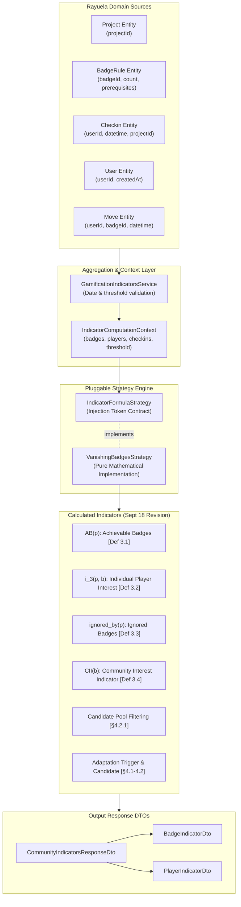

# Adaptive Gamification Indicators Engine

The **Adaptive Gamification Indicators Engine** calculates real-time community engagement, player contribution trajectories, and badge-specific interest metrics. These metrics empower the platform to automatically detect stagnation and adapt gamification rules to reignite volunteer participation.

---

## 1. Modular & Pluggable Architecture

The engine is engineered as a decoupled, isolated module within the backend architecture:

- **Isolated NestJS Module (`GamificationIndicatorsModule`)**: Completely decoupled from the transactional gamification engine and check-in processing pipeline. Evaluating indicators does not mutate user progression or lock database tables.
- **Pluggable Strategy Pattern (`IndicatorFormulaStrategy`)**: Mathematical calculations are extracted behind an abstract interface contract and bound via NestJS dependency injection (`INDICATOR_FORMULA_STRATEGY`).
- **Extensible & Flexible**: Different mathematical formulations, recency decay curves, or period aggregation windows can be plugged in or tested without modifying DAOs, controllers, or domain models.

```
┌────────────────────────────────────────────────────────┐
│             GamificationIndicatorsService             │
└───────────────────────────┬────────────────────────────┘
                            │ Delegates computation context
                            ▼
        ┌──────────────────────────────────────┐
        │     «interface»                      │
        │     IndicatorFormulaStrategy         │
        └──────────────────▲───────────────────┘
                           │ implements
        ┌──────────────────┴───────────────────┐
        │     VanishingBadgesStrategy          │
        │     (Pure Mathematical Calculation)  │
        └──────────────────────────────────────┘
```

---

## 2. Domain Model & Indicator Mapping

The indicators engine bridges Rayuela's core domain models into a unified computation context and maps the computed metrics into structured response DTOs:


```mermaid
flowchart TB
  subgraph Domain["Rayuela Domain Sources"]
    P["Project Entity<br/>(projectId)"]
    BR["BadgeRule Entity<br/>(badgeId, count, prerequisites)"]
    CI["Checkin Entity<br/>(userId, datetime, projectId)"]
    U["User Entity<br/>(userId, createdAt)"]
    MV["Move Entity<br/>(userId, badgeId, datetime)"]
  end

  subgraph Ingestion["Aggregation & Context Layer"]
    GIS["GamificationIndicatorsService<br/>(Date & threshold validation)"]
    CTX["IndicatorComputationContext<br/>(badges, players, checkins, threshold)"]
  end

  subgraph Strategy["Pluggable Strategy Engine"]
    IFS["IndicatorFormulaStrategy<br/>(Injection Token Contract)"]
    VBS["VanishingBadgesStrategy<br/>(Pure Mathematical Implementation)"]
  end

  subgraph Metrics["Calculated Indicators (Sept 18 Revision)"]
    AB["AB(p): Achievable Badges [Def 3.1]"]
    I3["i_3(p, b): Individual Player Interest [Def 3.2]"]
    IGN["ignored_by(p): Ignored Badges [Def 3.3]"]
    CII["CII(b): Community Interest Indicator [Def 3.4]"]
    FILT["Candidate Pool Filtering [§4.2.1]"]
    TRIG["Adaptation Trigger & Candidate [§4.1-4.2]"]
  end

  subgraph Output["Output Response DTOs"]
    RESP["CommunityIndicatorsResponseDto"]
    B_DTO["BadgeIndicatorDto"]
    P_DTO["PlayerIndicatorDto"]
  end

  Domain --> GIS
  GIS --> CTX
  CTX --> IFS
  IFS -. implements .- VBS
  VBS --> Metrics
  Metrics --> Output
  RESP --> B_DTO
  RESP --> P_DTO
```

### Domain Mapping Breakdown

| Rayuela Domain Entity / DAO | Input Role in Engine | Output Indicator |
| :--- | :--- | :--- |
| **`Project`** | Establishes the bounded community and context identifier. | `projectId` |
| **`BadgeRule` (`GamificationDao`)** | Defines target requirements, current badge status (`active`, `faded`, `expired`), and prerequisite DAG relationships. | $AB(p)$, $ep(b)$ (eligible pool), Candidate filtering (`allPlayerBadges`, `unreachableBadges`, `candidateBadges`) |
| **`User` (`UserDao`)** | Supplies player join dates ($t_{\text{join}}$) and registered account profiles. | $t_0(p, b)$ (baseline date for root badges) |
| **`Checkin` (`CheckInDao`)** | Provides timestamped citizen science contributions. | `totalContributions`, `activePlayers` |
| **`Move` (`MoveDao`)** | Records historical award events, tracking the exact timestamps at which players unlocked badges. | $B_p$, $U_b$ (earners set), $t_0(p, b)$ for child badges |

---

## 3. Mathematical Indicators Summary (Sept 18, 2026 Revision)

The default implementation (`VanishingBadgesStrategy`) evaluates Definitions 3.1–3.4 and Section 4.1–4.2 of the Vanishing Badges specification:

1. **Achievable Badges ($AB(p)$ — Def 3.1)**: A badge is achievable to a player when all prerequisite badges (`previousBadges`) have been earned:
   $$AB(p) = \{\, b \in \text{Badges} \mid \forall prev \in \text{prerequisites}(b),\, prev \in B_p \,\}$$
2. **Individual Interest Indicator ($i_3(p, b)$ — Def 3.2)**: Measures the inverse of the elapsed time (in days) since player $p$ met the prerequisites for badge $b$ ($t_0(p, b)$):
   $$i_3(p, b) = \begin{cases} \dfrac{1}{\text{now} - t_0(p, b)} & : b \in AB(p) \\ 1.0 & : b \notin AB(p) \end{cases}$$
3. **Ignored Badges ($\text{ignored\_by}(p)$ — Def 3.3)**: The subset of achievable, unearned badges for player $p$ whose individual interest has fallen below reference threshold $x$ (default $x = 0.20$, equivalent to $> 5$ days elapsed):
   $$\text{ignored\_by}(p) = \{\, b \in AB(p) \setminus B_p \mid i_3(p, b) < x \,\}$$
4. **Community Interest Indicator ($CII(b)$ — Def 3.4)**: The median individual interest across all players eligible to earn badge $b$ ($ep(b) = \{\, p \in P \mid b \in AB(p) \setminus B_p \,\}$):
   $$CII(b) = \text{median}(\{\, i_3(p, b) \mid p \in ep(b) \,\})$$
5. **Candidate Filtering (§4.2.1)**: Excludes badges already earned by everyone in the community (`allPlayerBadges`), badges unreachable by anyone (`unreachableBadges`), and expired badges to yield `candidateBadges`.
6. **Adaptation Trigger & Selection (§4.1 & §4.2.2–4.2.3)**:
   $$\text{Trigger Adaptation} \iff \exists b \in \text{Candidates} : CII(b) < x$$
   Candidate badges are sorted ascending by $CII(b)$ to identify the primary `adaptationCandidateBadge`.

---

## 4. Current State vs. Future Strategy Integration

### Current State: On-Demand REST Endpoint
The engine is currently exposed via an authenticated HTTP endpoint:
```http
GET /v1/gamification-indicators/:projectId?asOfDate=20-07-2026&threshold=0.20
Authorization: Bearer <JWT_TOKEN>
```
This allows:
- Real-time exploration and parameter tuning (`threshold`, point-in-time `asOfDate`, `minActiveCheckins`).
- Visual debugging through documentation tools and simulators.
- Empirical verification of community interest before enabling automated rule mutations.

### Future State: Automated Badge Fading Adaptation Loop
In upcoming phases, this engine will directly drive the **Badge Fading** adaptation strategy:
1. Periodically or upon check-in registration, the system runs `calculateIndicators` for active projects.
2. If any candidate badge's community interest drops below threshold ($\exists b \in \text{Candidates} : CII(b) < x$), `isTriggered` becomes `true`.
3. The engine selects the candidate badge with lowest interest ($b^* = \arg\min CII(b)$).
4. The system automatically transitions badge $b^*$ to `faded` status with an expiration timestamp (`expiresAt`), broadcasting notifications to prompt community participation during the Step 5 running impact window.

---

## 5. API Reference

### `GET /v1/gamification-indicators/:projectId`

#### Query Parameters

| Parameter | Type | Required | Default | Description |
| :--- | :--- | :--- | :--- | :--- |
| `asOfDate` | string | No | Now | Horizon timestamp. Accepts ISO-8601, `DD-MM-YYYY`, or `DD/MM/YYYY`. |
| `threshold` | number | No | `0.2` | Reference threshold $x$ for ignored badges (Def 3.3) and adaptation trigger (§4.1). |
| `minActiveCheckins` | number | No | `0` | Optional minimum contributions required to include a player in the evaluated pool $P$. |

#### Sample Response (`200 OK`)

```json
{
  "projectId": "67702f23258db9ef444b0e8b",
  "asOfDate": "2026-07-20T23:59:59.999Z",
  "threshold": 0.2,
  "totalPlayers": 10,
  "activePlayers": 8,
  "totalContributions": 45,
  "isTriggered": true,
  "triggerBadges": ["b-expert-mapper"],
  "communityIgnoredCount": 1,
  "totalPlayerIgnored": 4,
  "allPlayerBadges": ["b-first-checkin"],
  "unreachableBadges": ["b-master-scientist"],
  "candidateBadges": ["b-expert-mapper"],
  "lowestCII": 0.1429,
  "adaptationCandidateBadge": {
    "badgeId": "b-expert-mapper",
    "badgeName": "Mapeador Experto",
    "status": "active",
    "earnedCount": 1,
    "earnedUsers": ["user_101"],
    "eligibleCount": 4,
    "eligibleUsers": ["user_102", "user_103", "user_104", "user_105"],
    "CII": 0.1429,
    "isCommunityIgnored": true,
    "isCandidate": true,
    "isLowestCII": true
  },
  "badges": [
    {
      "badgeId": "b-expert-mapper",
      "badgeName": "Mapeador Experto",
      "status": "active",
      "earnedCount": 1,
      "earnedUsers": ["user_101"],
      "eligibleCount": 4,
      "eligibleUsers": ["user_102", "user_103", "user_104", "user_105"],
      "CII": 0.1429,
      "isCommunityIgnored": true,
      "isCandidate": true,
      "isLowestCII": true
    }
  ],
  "players": [
    {
      "playerId": "user_102",
      "totalContributions": 7,
      "earnedBadges": ["b-first-checkin"],
      "achievableBadges": ["b-first-checkin", "b-expert-mapper"],
      "ignoredBadges": ["b-expert-mapper"],
      "individualInterest": {
        "b-first-checkin": 1.0,
        "b-expert-mapper": 0.1429,
        "b-master-scientist": 1.0
      }
    }
  ]
}
```

---

### `GET /v1/gamification-indicators/:projectId/timeline`

Calculates and returns chronological snapshots of Community Interest ($CII(b)$) for all project badges over a selectable historical date window.

#### Query Parameters

| Parameter | Type | Required | Default | Description |
| :--- | :--- | :--- | :--- | :--- |
| `startDate` | string | No | 30 days before `endDate` | Window start date. Accepts ISO-8601, `DD-MM-YYYY`, or `DD/MM/YYYY`. |
| `endDate` | string | No | Now | Window end date. Accepts ISO-8601, `DD-MM-YYYY`, or `DD/MM/YYYY`. |
| `stepDays` | number | No | Dynamic (~15–30 points) | Sampling interval in days between snapshots (e.g. `1` for daily, `7` for weekly). |
| `threshold` | number | No | `0.2` | Reference threshold $x$ for ignored badges and adaptation trigger. |
| `badgeId` | string | No | All badges | Optional filter to return timeseries for a specific badge ID. |
| `minActiveCheckins` | number | No | `0` | Minimum contributions required to include players in evaluated pool $P$. |

#### Sample Response (`200 OK`)

```json
{
  "projectId": "67702f23258db9ef444b0e8b",
  "threshold": 0.2,
  "startDate": "2026-06-01T00:00:00.000Z",
  "endDate": "2026-07-01T23:59:59.999Z",
  "stepDays": 7,
  "timestamps": [
    "2026-06-01T00:00:00.000Z",
    "2026-06-08T00:00:00.000Z",
    "2026-06-15T00:00:00.000Z",
    "2026-06-22T00:00:00.000Z",
    "2026-07-01T23:59:59.999Z"
  ],
  "series": [
    {
      "badgeId": "b-expert-mapper",
      "badgeName": "Mapeador Experto",
      "status": "active",
      "points": [0.45, 0.38, 0.25, 0.18, 0.1429],
      "isCandidate": true,
      "isLowestCII": true,
      "currentCII": 0.1429
    }
  ]
}
```

